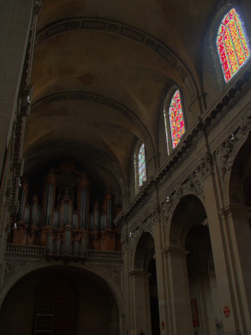

# IG-renderer
A CPU renderer written in standard c++

## Installation and requirements

Just clone this repo in your machine and you're done!

Please ensure you've got a C++ compiler installation on your machine. This project uses
[Premake 5](https://premake.github.io) as its build system, so you can customize your
environment as you wish.

## GNU/Makefile:

Generate the project using Premake:
```
premake5 gmake
```

After that, you can execute the Makefile:

```
make
```
You can also choose which project to build. This repo includes two projects:
- Renderer:
```
make Renderer
```
- Tonemapper:
```
make Tonemapper
```
> **Note**
> The default makefile command builds the app with debug symbols. In order to generate production-ready and optimized builds, enter the `config=release` option:
```
make config=release
```

## Visual Studio:
Generate the project using Premake:
```
premake5 vs2022
```

## Other 
Please refer to the [Premake Docs](https://premake.github.io/docs/Using-Premake/) if you need another action for your custom environment.

---

## Usage

```bash
./bin/ToneMapper <in_file{bmp|ppm}> <out_file.{bmp|ppm}>
```

```bash
./bin/Renderer
```

## Extensions

### Parallel rendering
This renderer allows parallel rendering on the CPU, deferring tasks on a queue so threads can process them and return the result back.
The number of threads can be chosed by hand but it is recommended to allow the maximum number of threads for peak performance.

## Funny mistakes

Here are some funny rendering mistakes that we found during development:

<div style="display: grid; gap:2em; grid-template-columns: repeat(3, 1fr);">
    <div style="display: flex; flex-direction:column; align-items: center;" >
        
        <p style="text-align: center;" >Some spooky errors while doing local tonemapping</p>
    </div>
    <div style="display: flex; flex-direction:column; align-items: center;" >
        
        <p style="text-align: center;" >A loosely familiar shape...</p>
    </div>
    <div style="display: flex; flex-direction:column; align-items: center;" >
        
        <p style="text-align: center;" >UFO encounter!</p>
    </div>
</div>
---

## Debugging

We all know how annoying C/C++ can be with memory management, so here's a little tool to help. First install Valgrind on your machine via package manager or from the [official website](https://valgrind.org). After that, execute Valgrind with the executable as an argument:

```bash
valgrind --track-origins=yes --verbose ./bin/ToneMapper
```

## References

- [PPM format specification](https://netpbm.sourceforge.net/doc/ppm.html)
- [BMP format explained](http://www.ue.eti.pg.gda.pl/fpgalab/zadania.spartan3/zad_vga_struktura_pliku_bmp_en.html)
- A great article about Tone Mapping: [Tone Mapping | δelta](https://64.github.io/tonemapping/), by 64